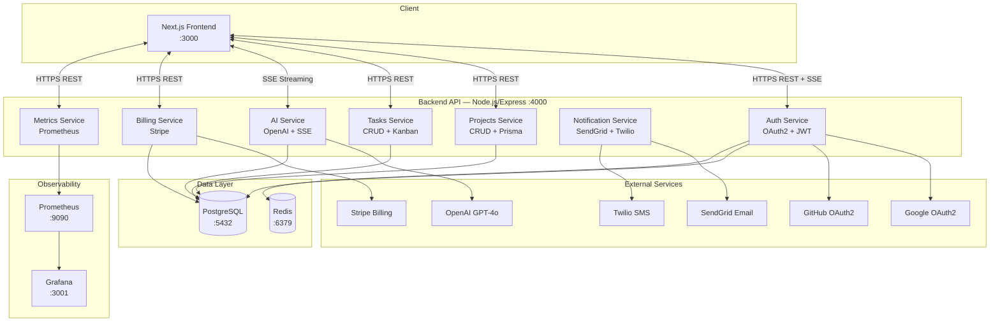
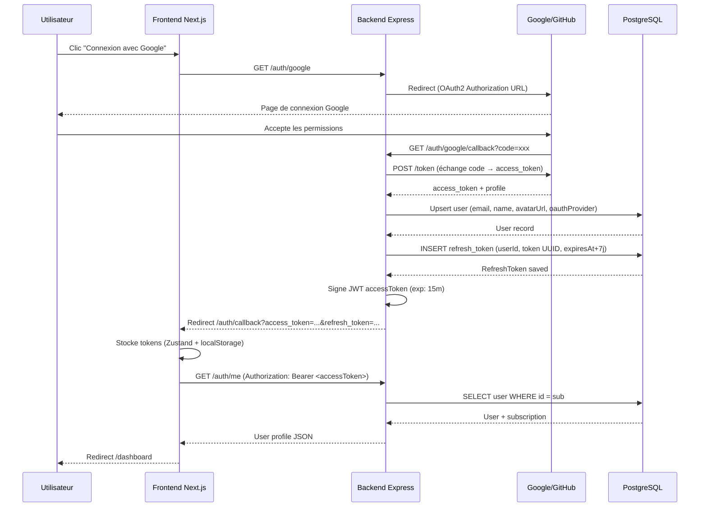
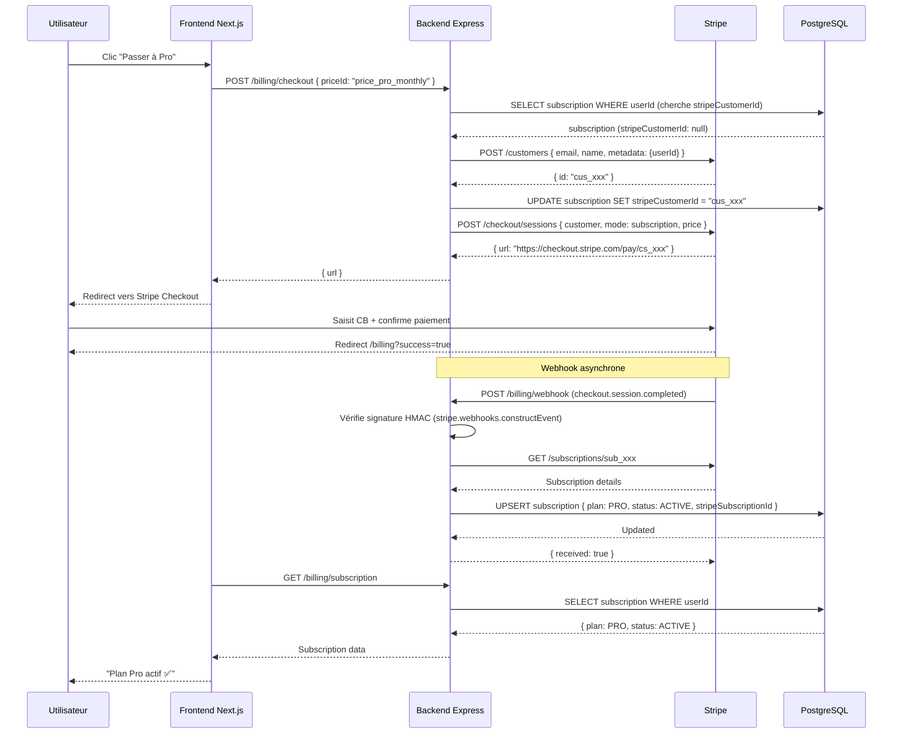
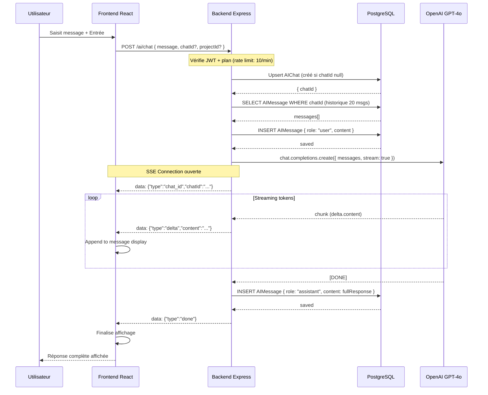

# SmartProject AI — Architecture Complète

## 1. Diagramme Microservices



---

## 2. Diagramme Séquence — Login OAuth2



---

## 3. Diagramme Séquence — Paiement Stripe



---

## 4. Diagramme Séquence — Requête IA (Chat Streaming)



---

## 5. Diagramme ERD (Base de Données)

```mermaid
erDiagram
    USER {
        string id PK
        string email UK
        string name
        string avatarUrl
        enum role
        enum oauthProvider
        string oauthProviderId
        string passwordHash
        string phone
        string timezone
        boolean isActive
        boolean emailVerified
        datetime lastLoginAt
        datetime createdAt
        datetime updatedAt
    }

    REFRESH_TOKEN {
        string id PK
        string token UK
        string userId FK
        datetime expiresAt
        datetime revokedAt
        string ipAddress
        string userAgent
        datetime createdAt
    }

    PROJECT {
        string id PK
        string name
        string description
        enum status
        datetime startDate
        datetime endDate
        string color
        string ownerId FK
        datetime createdAt
        datetime updatedAt
    }

    PROJECT_MEMBER {
        string id PK
        string projectId FK
        string userId FK
        string role
        datetime joinedAt
    }

    TASK {
        string id PK
        string title
        string description
        enum status
        enum priority
        datetime dueDate
        datetime startDate
        float estimatedHours
        float loggedHours
        string[] tags
        string projectId FK
        string assigneeId FK
        string creatorId FK
        string parentTaskId FK
        datetime createdAt
        datetime updatedAt
    }

    ACTIVITY_LOG {
        string id PK
        string action
        json metadata
        string userId FK
        string projectId FK
        string taskId FK
        string ipAddress
        datetime createdAt
    }

    SUBSCRIPTION {
        string id PK
        string userId FK UK
        enum plan
        enum status
        string stripeCustomerId UK
        string stripeSubscriptionId UK
        string stripePriceId
        datetime currentPeriodStart
        datetime currentPeriodEnd
        boolean cancelAtPeriodEnd
        datetime trialEnd
    }

    NOTIFICATION {
        string id PK
        string userId FK
        string type
        string title
        string body
        boolean isRead
        json metadata
        datetime createdAt
    }

    AI_CHAT {
        string id PK
        string userId FK
        string projectId FK
        string title
        datetime createdAt
        datetime updatedAt
    }

    AI_MESSAGE {
        string id PK
        string chatId FK
        string role
        string content
        json metadata
        datetime createdAt
    }

    USER ||--o{ REFRESH_TOKEN : "has"
    USER ||--o{ PROJECT : "owns"
    USER ||--o{ PROJECT_MEMBER : "member_of"
    USER ||--|| SUBSCRIPTION : "has"
    USER ||--o{ TASK : "assigns"
    USER ||--o{ TASK : "creates"
    USER ||--o{ ACTIVITY_LOG : "generates"
    USER ||--o{ NOTIFICATION : "receives"
    USER ||--o{ AI_CHAT : "has"

    PROJECT ||--o{ PROJECT_MEMBER : "has"
    PROJECT ||--o{ TASK : "contains"
    PROJECT ||--o{ ACTIVITY_LOG : "has"
    PROJECT ||--o{ AI_CHAT : "context_for"

    TASK ||--o{ TASK : "subtask_of"
    TASK ||--o{ ACTIVITY_LOG : "has"

    AI_CHAT ||--o{ AI_MESSAGE : "contains"
```

---

## 6. Arborescence Complète du Projet

```
smartproject-ai/
├── apps/
│   ├── frontend/                     # Next.js 14 App Router
│   │   ├── app/
│   │   │   ├── layout.tsx            # Root layout
│   │   │   ├── page.tsx              # Landing page
│   │   │   ├── providers.tsx         # SWR + providers
│   │   │   ├── globals.css           # Global styles
│   │   │   ├── auth/callback/page.tsx# OAuth callback handler
│   │   │   ├── login/page.tsx        # Login avec OAuth
│   │   │   ├── dashboard/page.tsx    # KPI dashboard
│   │   │   ├── projects/
│   │   │   │   ├── page.tsx          # Liste projets
│   │   │   │   └── [id]/page.tsx     # Détail projet + kanban
│   │   │   ├── tasks/
│   │   │   │   ├── page.tsx          # Liste tâches
│   │   │   │   └── [id]/page.tsx     # Détail tâche
│   │   │   ├── ai/page.tsx           # Chat IA
│   │   │   ├── billing/page.tsx      # Plans + Stripe
│   │   │   ├── admin/page.tsx        # Admin users
│   │   │   ├── metrics/page.tsx      # Grafana embed
│   │   │   └── profile/page.tsx      # Profile utilisateur
│   │   ├── components/
│   │   │   ├── layout/
│   │   │   │   ├── AppLayout.tsx
│   │   │   │   ├── Sidebar.tsx
│   │   │   │   └── Navbar.tsx
│   │   │   ├── ui/
│   │   │   │   ├── KPICard.tsx
│   │   │   │   ├── ProjectCard.tsx
│   │   │   │   ├── TaskCard.tsx
│   │   │   │   └── Modal.tsx
│   │   │   ├── charts/
│   │   │   │   └── ActivityChart.tsx  # Recharts
│   │   │   ├── ai/
│   │   │   │   └── ChatUI.tsx         # SSE streaming chat
│   │   │   ├── auth/
│   │   │   │   └── LoginButtons.tsx
│   │   │   └── dashboard/
│   │   │       └── RecentActivity.tsx
│   │   ├── hooks/
│   │   │   └── useAuth.ts            # Auth hook
│   │   ├── store/
│   │   │   └── auth.store.ts         # Zustand store
│   │   ├── lib/
│   │   │   └── api.ts                # Axios + interceptors
│   │   ├── cypress/
│   │   │   ├── e2e/
│   │   │   │   ├── login.cy.ts
│   │   │   │   ├── projects.cy.ts
│   │   │   │   ├── ai-chat.cy.ts
│   │   │   │   └── billing.cy.ts
│   │   │   └── support/e2e.ts
│   │   ├── next.config.ts
│   │   ├── tailwind.config.ts
│   │   ├── cypress.config.ts
│   │   ├── package.json
│   │   └── Dockerfile
│   │
│   └── backend/                      # Node.js Express API
│       └── src/
│           ├── index.ts              # App entry point
│           ├── config/
│           │   └── passport.ts       # OAuth strategies
│           ├── routes/
│           │   ├── auth.routes.ts
│           │   ├── projects.routes.ts
│           │   ├── tasks.routes.ts
│           │   ├── ai.routes.ts
│           │   ├── billing.routes.ts
│           │   ├── notifications.routes.ts
│           │   ├── metrics.routes.ts
│           │   └── admin.routes.ts
│           ├── controllers/
│           │   ├── auth.controller.ts
│           │   ├── projects.controller.ts
│           │   ├── tasks.controller.ts
│           │   ├── ai.controller.ts
│           │   └── billing.controller.ts
│           ├── services/
│           │   ├── auth.service.ts
│           │   ├── projects.service.ts
│           │   ├── tasks.service.ts
│           │   ├── ai.service.ts
│           │   ├── billing.service.ts
│           │   └── notification.service.ts
│           ├── middlewares/
│           │   ├── auth.middleware.ts
│           │   ├── error.middleware.ts
│           │   ├── metrics.middleware.ts
│           │   └── rate-limit.middleware.ts
│           ├── clients/
│           │   ├── openai.client.ts
│           │   ├── stripe.client.ts
│           │   ├── sendgrid.client.ts
│           │   ├── twilio.client.ts
│           │   └── prometheus.client.ts
│           ├── lib/
│           │   ├── prisma.ts
│           │   └── logger.ts
│           └── __tests__/
│               ├── auth.service.test.ts
│               ├── projects.service.test.ts
│               ├── ai.service.test.ts
│               ├── billing.service.test.ts
│               └── notification.service.test.ts
│
├── packages/
│   ├── types/
│   │   ├── index.ts                  # Shared TypeScript types
│   │   └── package.json
│   └── shared/
│       ├── utils.ts                  # Shared utilities
│       └── package.json
│
├── prisma/
│   ├── schema.prisma                 # Database schema (6 models)
│   └── seed.ts                       # Database seed
│
├── infra/
│   ├── prometheus/prometheus.yml
│   └── grafana/
│       └── provisioning/datasources/datasource.yml
│
├── docs/
│   ├── architecture.md               # Ce fichier
│   ├── BC01-cadrage.md
│   ├── BC02-tests-docs.md
│   ├── BC03-pilotage.md
│   └── BC04-maintenance.md
│
├── docker-compose.yml
├── turbo.json
├── package.json
└── .env.example
```
